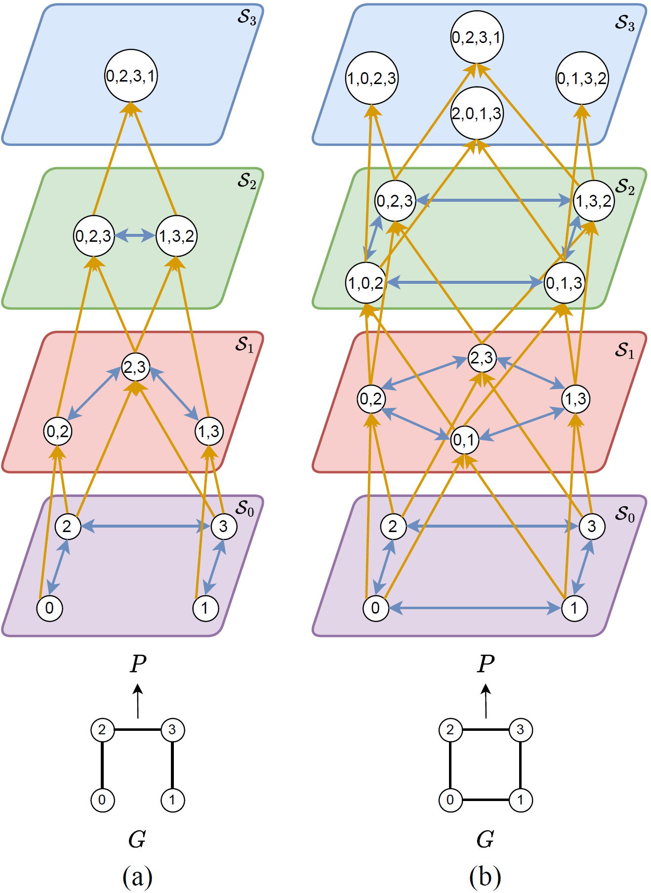

# Path Complex Networks

[](https://arxiv.org/abs/2308.06838)
[](https://ojs.aaai.org/index.php/AAAI/article/view/29463)

<p align="center">
    
</p>

## Overview

This repository contains an implementation of Path Complex Networks based on the ideas introduced in:

**Weisfeiler and Lehman Go Paths: Learning Topological Features via Path Complexes**  
Quang Truong and Peter Chin  
AAAI 2024

The codebase is intended for experimentation, reproduction, and extension of path-complex-based graph learning methods. I started with Quang's 2024 version.

## Abstract

*Graph Neural Networks (GNNs), despite achieving remarkable performance across different tasks, are theoretically bounded by the 1-Weisfeiler-Lehman test, resulting in limitations in terms of graph expressivity. Even though prior works on topological higher-order GNNs overcome that boundary, these models often depend on assumptions about sub-structures of graphs. Specifically, topological GNNs leverage the prevalence of cliques, cycles, and rings to enhance the message-passing procedure. This work focuses on simple paths within graphs during the topological message-passing process, allowing the model to capture higher-order structure without relying on restrictive assumptions about specific subgraph types.*

## Installation

This project uses `Python 3.8.15`, `PyTorch 1.12.1`, `PyTorch Geometric 2.2.0`, and `CUDA 11.6`.

Create and activate the environment:

```bash
conda create --name pcn python=3.8.15
conda activate pcn
conda install pip

sh graph-tools_install.sh
conda install pytorch==1.12.1 torchvision==0.13.1 torchaudio==0.12.1 cudatoolkit=11.6 -c pytorch -c conda-forge
sh pyg_install.sh cu116
pip install -r requirements.txt